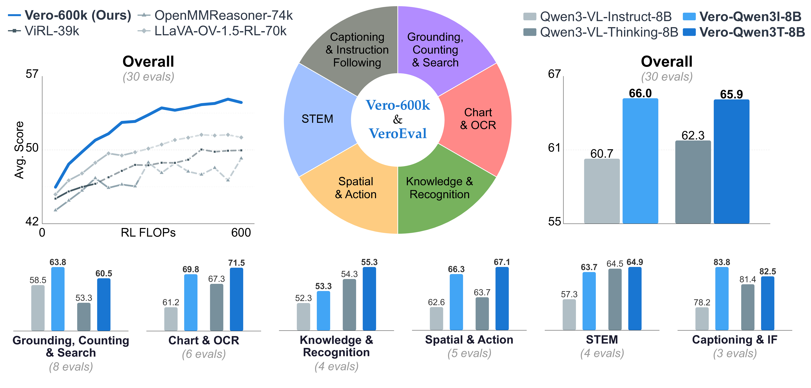
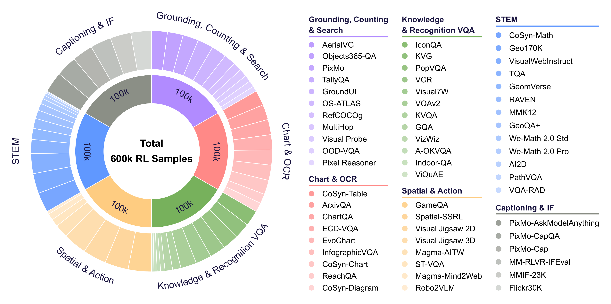

<p align="center">
  
</p>

<p align="center">
  <a href="https://arxiv.org/abs/2604.04917">
    
  </a>
  <a href="https://huggingface.co/collections/zlab-princeton/vero">
    
  </a>
  <a href="https://huggingface.co/datasets/zlab-princeton/Vero-600k">
    
  </a>
  <a href="https://vero-reasoning.github.io/">
    
  </a>
</p>

# Vero: An Open RL Recipe for General Visual Reasoning

Vero is a fully open reinforcement learning recipe for training and evaluating multi-task visual reasoning with vision-language models.

The released project combines an RL training stack (`vero-rl`) and an evaluation harness (`vero-eval`).

<p align="center">
  
</p>

---

## Highlights

- 600K curated RL samples from 59 datasets across 6 visual reasoning task categories: STEM, Chart & OCR, Spatial & Action, Knowledge & Recognition, Grounding, Counting & Search, & Captioning & Instruction Following
- Single-stage RL recipe for visual reasoning with task-routed reward functions
- VeroEvalSuite with 30 benchmarks spanning the 6 multimodal reasoning task categories
- Support for many base models: Qwen3.5, Qwen2.5-VL, Qwen3-VL, MiMo-VL, Bee, Molmo2
- Fully open codebase for training and evaluation

---

## Installation

### Clone Repository

```bash
git clone https://github.com/zlab-princeton/vero.git
cd vero
```

### Environment Setup

```bash
bash scripts/setup_env.sh
```

This installs PyTorch, vLLM, Transformers, FlashAttention, and both project packages (`vero-rl`, `vero-eval`) in editable mode. See [scripts/setup_env.sh](scripts/setup_env.sh) for the full setup flow.

---

## Data Setup

<p align="center" style="padding: 20px;">
  
</p>

For Vero RL training, the model-run scripts use formatted local data under `vero-rl/data` by default.
Prepare it once with:

```bash
python scripts/download_and_format_vero_600k.py
```

This script downloads or reuses cached data from [`zlab-princeton/Vero-600k`](https://huggingface.co/datasets/zlab-princeton/Vero-600k), exports images into `vero-rl/data/images/`, and writes:

```text
vero-rl/data/vero_600k_train.verl.jsonl
vero-rl/data/vero_600k_val.verl.jsonl
```

All bash launchers in [`vero-rl/examples/model_runs/`](vero-rl/examples/model_runs/) will pick up those files automatically once they exist.

For custom data, Vero expects a [specific data format](docs/DATA.md) for RL training. 

For dataset format, curation details, and reward routing metadata, see [docs/DATA.md](docs/DATA.md).

---

## Vero Reward

We open source our runtime reward stack in [`vero-rl/vero_reward`](vero-rl/vero_reward). Its main entrypoint, [`math_verify_reward_type_boxed.py`](vero-rl/vero_reward/math_verify_reward_type_boxed.py), routes scoring by `reward_type` and combines strict `<think>/<answer>` format checks with task-specific accuracy. The package covers boxed/numeric/string-match style rewards, grounding rewards based on bbox matching in [`grounding_reward.py`](vero-rl/vero_reward/grounding_reward.py), clicking rewards based on point-in-box checks in [`click_reward.py`](vero-rl/vero_reward/click_reward.py), and instruction-following checks in [`instructions.py`](vero-rl/vero_reward/instructions.py).

During Vero RL training, these rule-based rewards are combined with an LLM-judge path implemented in [`vero_vllm_judge.py`](vero-rl/verl/workers/reward_manager/vero_vllm_judge.py). The shared model-run config [`gspo_llmjudge_shared.yaml`](vero-rl/examples/model_runs/config/gspo_llmjudge_shared.yaml) enables the `vero_vllm_judge` reward manager, points the custom reward function at [`vero_reward/math_verify_reward_type_boxed.py`](vero-rl/vero_reward/math_verify_reward_type_boxed.py), and configures judge parameters such as the local API endpoint, sampling settings, sleep mode, and the instruction-following blend weight.

The LLM judge itself uses the prompt in [`llm_judge_reference.txt`](vero-rl/examples/prompts/llm_judge_reference.txt), which asks the judge model to compare the rollout answer against a reference answer and return a structured 1-10 score. In the standard training scripts such as [`run_gspo_qwen3vl_instruct_mix_all_llmjudge.sh`](vero-rl/examples/model_runs/run_gspo_qwen3vl_instruct_mix_all_llmjudge.sh), the judge server is started automatically by sourcing [`llm_judge_server.sh`](vero-rl/examples/model_runs/shared/llm_judge_server.sh), which launches a local `vllm serve` process, waits for readiness, and prepares the server for training-time reward calls.


---

## Model Checkpoints

Pretrained Huggingface checkpoints are available via the following links:

| Model | Base Model | Parameters | HF Link |
|-------|------------|------------|--------------|
| `Vero-Qwen25-7B` | Qwen2.5-VL-7B-Instruct | 7B | [zlab-princeton/Vero-Qwen25-7B](https://huggingface.co/zlab-princeton/Vero-Qwen25-7B) |
| `Vero-Qwen3I-8B` | Qwen3-VL-8B-Instruct | 8B | [zlab-princeton/Vero-Qwen3I-8B](https://huggingface.co/zlab-princeton/Vero-Qwen3I-8B) |
| `Vero-Qwen3T-8B` | Qwen3-VL-8B-Thinking | 8B | [zlab-princeton/Vero-Qwen3T-8B](https://huggingface.co/zlab-princeton/Vero-Qwen3T-8B) |
| `Vero-MiMo-7B` | MiMo-VL-7B-SFT | 7B | [zlab-princeton/Vero-MiMo-7B](https://huggingface.co/zlab-princeton/Vero-MiMo-7B) |

See [docs/MODELS.md](docs/MODELS.md) for the documented model families, training settings, and inference format.

---

### Supported Training Launch Scripts

| Script | Model Family | Base Model |
|--------|--------------|------------|
| [Train Vero-Qwen25-7B](vero-rl/examples/model_runs/run_gspo_qwen25vl_instruct_mix_all_llmjudge.sh) | `Vero-Qwen25-7B` | Qwen2.5-VL-7B-Instruct |
| [Train Vero-Qwen3I-8B](vero-rl/examples/model_runs/run_gspo_qwen3vl_instruct_mix_all_llmjudge.sh) | `Vero-Qwen3I-8B` | Qwen3-VL-8B-Instruct |
| [Train Vero-MiMo-7B](vero-rl/examples/model_runs/run_gspo_mimovl_mix_all_llmjudge.sh) | `Vero-MiMo-7B` | MiMo-VL-7B-SFT |

### Quick Start

First prepare the repo-local training data:

```bash
python scripts/download_and_format_vero_600k.py
```

Then launch a training run. `TRAIN_FILES`, `VAL_FILES`, and `IMAGE_ROOT` are optional overrides if you want to point at different formatted data.

```bash
export ROOT_PATH="/path/to/data_root"  # for datasets and checkpoints
cd vero-rl
bash examples/model_runs/run_gspo_qwen3vl_instruct_mix_all_llmjudge.sh
```

Optional dataset overrides:

```bash
export TRAIN_FILES="/path/to/train.verl.jsonl"
export VAL_FILES="/path/to/val.verl.jsonl"
export IMAGE_ROOT="/path/to/data_root"
```

The training scripts auto-detect `REPO_ROOT` from their location, manage the LLM judge server automatically, and use Hydra-based configs from `vero-rl/examples/model_runs/config/`.

---

## Evaluation

Vero is evaluated with `vero-eval`, an evaluation harness built on [lmms-eval](https://github.com/EvolvingLMMs-Lab/lmms-eval) which houses VeroEvalSuite, a 30-benchmark suite spanning:

- Chart and OCR
- STEM reasoning
- Spatial reasoning and action
- Knowledge and recognition
- Grounding, counting, and visual search
- Captioning and instruction following

### Evaluation Benchmarks

| Task Category | Benchmarks |
|---------------|------------|
| Chart & OCR | [ChartQA-Pro](vero-eval/lmms_eval/tasks/chartqa_pro), [ChartQA](vero-eval/lmms_eval/tasks/chartqa), [InfoVQA](vero-eval/lmms_eval/tasks/infovqa), [CharXiv](vero-eval/lmms_eval/tasks/charxiv), [ChartMuseum](vero-eval/lmms_eval/tasks/chartmuseum), [EvoChart](vero-eval/lmms_eval/tasks/evochart) |
| STEM | [MMMU-PRO Standard](vero-eval/lmms_eval/tasks/mmmu_pro), [MMMU-PRO Vision](vero-eval/lmms_eval/tasks/mmmu_pro), [MathVision](vero-eval/lmms_eval/tasks/mathvision), [MathVista](vero-eval/lmms_eval/tasks/mathvista) |
| Spatial & Action | [Blink](vero-eval/lmms_eval/tasks/blink), [ERQA](vero-eval/lmms_eval/tasks/erqa), [GameQA](vero-eval/lmms_eval/tasks/game_qa), [EmbSpatial](vero-eval/lmms_eval/tasks/embspatial), [CVBench](vero-eval/lmms_eval/tasks/cv_bench) |
| Knowledge & Recognition | [RealWorldQA](vero-eval/lmms_eval/tasks/realworldqa), [SimpleVQA (English)](vero-eval/lmms_eval/tasks/simplevqa), [FVQA](vero-eval/lmms_eval/tasks/fvqa), [MM-Vet V2](vero-eval/lmms_eval/tasks/mmvetv2) |
| Grounding, Counting & Visual Search | [CountBenchQA](vero-eval/lmms_eval/tasks/countbenchqa), [CountQA](vero-eval/lmms_eval/tasks/countqa), [MMERealWorld](vero-eval/lmms_eval/tasks/mme_realworld), [VStarBench](vero-eval/lmms_eval/tasks/vstar_bench), [AerialVG](vero-eval/lmms_eval/tasks/aerialvg), [VisualProbe](vero-eval/lmms_eval/tasks/visual_probe), [ScreenSpot](vero-eval/lmms_eval/tasks/screenspot_point_in_box), [ScreenSpotPro](vero-eval/lmms_eval/tasks/screenspotpro) |
| Captioning & Instruction Following | [MM-MTBench](vero-eval/lmms_eval/tasks/mm_mt_bench), [MIABench](vero-eval/lmms_eval/tasks/mia_bench), [MMIFEval](vero-eval/lmms_eval/tasks/mmifeval) |

### Quick Start

```bash
cd vero-eval

# Evaluate on a single task
bash examples/eval.sh \
    --model-path zlab-princeton/Vero-Qwen3I-8B \
    --tasks chartqa_reasoning

# Evaluate on a full domain
bash examples/eval_domain.sh \
    --model-path zlab-princeton/Vero-Qwen3I-8B \
    --domain chart_ocr \
    --variant reasoning
```

For direct `lmms_eval` usage:

```bash
cd vero-eval

python -m lmms_eval \
    --model vllm \
    --model_args model=zlab-princeton/Vero-Qwen3I-8B,tensor_parallel_size=1 \
    --tasks chartqa_reasoning \
    --batch_size 2048 \
    --output_path ./eval_results/
```

See [docs/EVALUATION.md](docs/EVALUATION.md) for benchmark coverage, judge configuration, and evaluation workflows.

---

## Repository Structure

```text
Vero/
|-- docs/          Data, training, evaluation, and model documentation
|-- scripts/       Environment setup and data filtering scripts
|-- vero-eval/     Evaluation harness built around lmms-eval
`-- vero-rl/       RL training framework built around veRL
```

---

## Documentation

- [Training Guide](docs/TRAINING.md)
- [Evaluation Guide](docs/EVALUATION.md)
- [Data Guide](docs/DATA.md)
- [Model Guide](docs/MODELS.md)

---

## Citation

If you use this repository, please cite:

```bibtex
@article{sarch2026vero,
    title   = {Vero: An Open RL Recipe for General Visual Reasoning},
    author  = {Sarch, Gabriel and Cai, Linrong and Wang, Qunzhong and Wu, Haoyang and Chen, Danqi and Liu, Zhuang},
    year    = {2026},
    journal = {arXiv preprint arXiv:2604.04917},
  }
```


---

## Acknowledgements

This project builds on several strong open-source foundations:

- [veRL](https://github.com/volcengine/verl) for distributed RL training infrastructure
- [lmms-eval](https://github.com/EvolvingLMMs-Lab/lmms-eval) for multimodal evaluation

---

## License

This project is licensed under the [Apache License 2.0](LICENSE).
