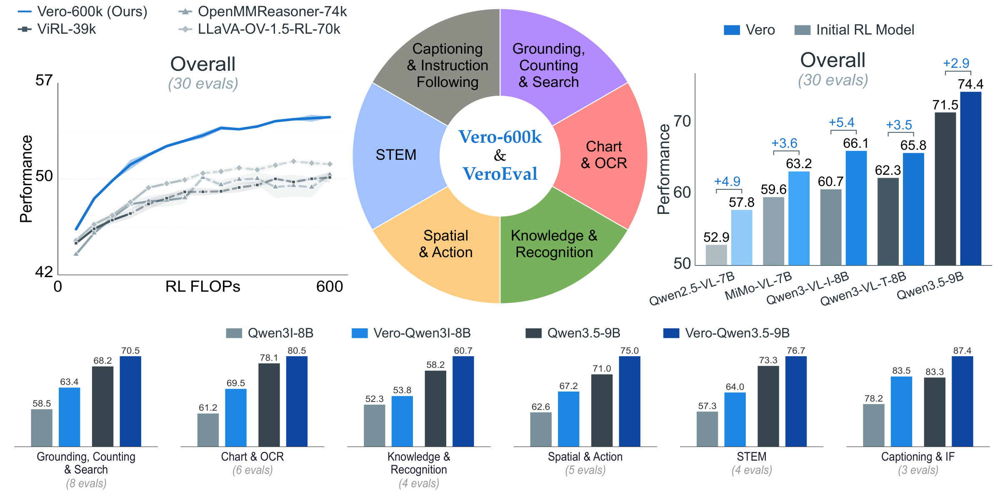
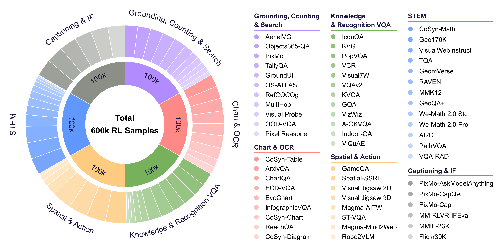

<p align="center">
  
</p>

<p align="center">
  <a href="https://arxiv.org/abs/2604.04917">
    
  </a>
  <a href="https://huggingface.co/collections/zlab-princeton/vero">
    
  </a>
  <a href="https://huggingface.co/datasets/zlab-princeton/Vero-600k">
    
  </a>
  <a href="https://vero-reasoning.github.io/">
    
  </a>
</p>

# Vero: An Open RL Recipe for General Visual Reasoning

Vero is a fully open reinforcement learning recipe for training and evaluating multi-task visual reasoning with vision-language models.

The released project combines an RL training stack (`vero-rl`) and an evaluation harness (`vero-eval`).

<p align="center">
  
</p>

---

## News

- **2026-06-17 — Second release.** We expanded Vero with new model checkpoints and larger training data: [`Vero-Qwen35-9B`](https://huggingface.co/zlab-princeton/Vero-Qwen35-9B) and [`Vero-Qwen35-9B-Base`](https://huggingface.co/zlab-princeton/Vero-Qwen35-9B-Base), plus the [`Vero-1.6M`](https://huggingface.co/datasets/zlab-princeton/Vero-1.6M) and [`Vero-2.5M-unfiltered`](https://huggingface.co/datasets/zlab-princeton/Vero-2.5M-unfiltered) datasets.
- **2026-06 — Oral at CVPR 2026.** Vero was selected for an oral presentation at the [DataMFM workshop](https://datamfm.github.io/) (Emerging Directions in Data for Multimodal Foundation Models) at CVPR 2026.

---

## Highlights

- 600K curated RL samples from 59 datasets across 6 visual reasoning task categories: STEM, Chart & OCR, Spatial & Action, Knowledge & Recognition, Grounding, Counting & Search, & Captioning & Instruction Following
- Single-stage RL recipe for visual reasoning with task-routed reward functions
- VeroEvalSuite with 30 benchmarks spanning the 6 multimodal reasoning task categories
- Support for many base models: Qwen3.5, Qwen2.5-VL, Qwen3-VL, MiMo-VL, Bee, Molmo2
- Fully open codebase for training and evaluation

---

## Installation

### Clone Repository

```bash
git clone https://github.com/zlab-princeton/vero.git
cd vero
```

### Environment Setup

```bash
bash scripts/setup_env.sh
```

This installs PyTorch, vLLM, Transformers, FlashAttention, and both project packages (`vero-rl`, `vero-eval`) in editable mode. See [scripts/setup_env.sh](scripts/setup_env.sh) for the full setup flow.

---

## Data Setup

<p align="center" style="padding: 20px;">
  
</p>

For Vero RL training, the model-run scripts use formatted local data under `vero-rl/data` by default.
Prepare it once with:

```bash
python scripts/download_and_format_vero_600k.py
```

This script downloads or reuses cached data from [`zlab-princeton/Vero-600k`](https://huggingface.co/datasets/zlab-princeton/Vero-600k), exports images into `vero-rl/data/images/`, and writes:

```text
vero-rl/data/vero_600k_train.verl.jsonl
vero-rl/data/vero_600k_val.verl.jsonl
```

All bash launchers in [`vero-rl/examples/model_runs/`](vero-rl/examples/model_runs/) will pick up those files automatically once they exist.

Larger datasets from the second release — [`zlab-princeton/Vero-1.6M`](https://huggingface.co/datasets/zlab-princeton/Vero-1.6M) and [`zlab-princeton/Vero-2.5M-unfiltered`](https://huggingface.co/datasets/zlab-princeton/Vero-2.5M-unfiltered) — are also available on the Hub; the default training setup uses `Vero-600k`.

For custom data, Vero expects a specific data format; see [docs/DATA.md](docs/DATA.md) for the format, curation details, and reward routing metadata.

---

## Quick Start: Evaluation

Evaluation is independent of training — to just run the benchmarks, you can skip the training setup entirely. (For the full benchmark list, see [Evaluation Benchmarks](#evaluation-benchmarks).)

> **Want it hands-off?** Point an AI coding agent (Claude Code / Codex) at
> [docs/AGENTS_SETUP.md](docs/AGENTS_SETUP.md) — a one-file runbook it (or a human) can
> follow end to end to set up the environment and run the full reproduction.

**1. One-time setup.** `set_paths.sh` configures the env, caches, and the judge
(`JUDGE_MODEL_PATH` + `API_TYPE`), so judge-based tasks work right after sourcing:

```bash
cp scripts/set_paths.sh.example set_paths.sh   # edit ROOT_PATH (a roomy disk)
source set_paths.sh                            # HF_HOME, caches, JUDGE_MODEL_PATH, API_TYPE
huggingface-cli login                          # gated datasets (e.g. MMMU_Pro)
```

**2. Evaluate.** The model defaults to `zlab-princeton/Vero-Qwen3I-8B` (override with
`--model-path`):

```bash
cd vero-eval

# Smoke test — one rule-based task, 1 GPU, a few samples
bash examples/eval.sh --tasks chartqa_reasoning --limit 5

# Reproduce the FULL suite — all 30 benchmarks, no --limit (judge tasks need 2 GPUs)
bash examples/eval_domain.sh --domain all --num-gpus 2
```

Choose the `--variant` that matches the checkpoint type (instruct vs thinking):

| Vero checkpoint | Type | `--variant` |
|-----------------|------|-------------|
| `Vero-Qwen25-7B`, `Vero-Qwen3I-8B` | instruct | `reasoning` (default) |
| `Vero-Qwen3T-8B`, `Vero-MiMo-7B`, `Vero-Qwen35-9B`, `Vero-Qwen35-9B-Base` | thinking | `reasoning_samplingq3` |

For a thinking checkpoint, pass the model and its variant explicitly:

```bash
bash examples/eval_domain.sh \
    --model-path zlab-princeton/Vero-Qwen3T-8B \
    --domain all --variant reasoning_samplingq3 --num-gpus 2
```

> **Notes.** Verify a machine first with `bash examples/preflight.sh` (optional).
> The judge comes from `JUDGE_MODEL_PATH` (set by `set_paths.sh`); if unset, judge tasks
> fall back to OpenAI `gpt-4o` and need `GPT_API_KEY`. Judge-based tasks need 2 GPUs.

See [docs/EVALUATION.md](docs/EVALUATION.md) for benchmark coverage, judge configuration, and evaluation workflows.

---

## Quick Start: Training

First set cache paths (the base model and reward judge download on the fly under `HF_HOME`) and prepare the repo-local training data:

```bash
cp scripts/set_paths.sh.example set_paths.sh   # edit ROOT_PATH (a roomy disk)
source set_paths.sh                            # sets HF_HOME, activates verovlm
python scripts/download_and_format_vero_600k.py
```

Then launch a training run. `TRAIN_FILES`, `VAL_FILES`, and `IMAGE_ROOT` are optional overrides if you want to point at different formatted data.

```bash
export ROOT_PATH="/path/to/data_root"  # for datasets and checkpoints
cd vero-rl
bash examples/model_runs/run_gspo_qwen3vl_instruct_mix_all_llmjudge.sh
```

The reward judge (`Qwen/Qwen3.5-27B` by default) downloads on first use; override it with `export VLLM_JUDGE_MODEL_PATH=<model>`.

Optional dataset overrides:

```bash
export TRAIN_FILES="/path/to/train.verl.jsonl"
export VAL_FILES="/path/to/val.verl.jsonl"
export IMAGE_ROOT="/path/to/data_root"
```

See [docs/TRAINING.md](docs/TRAINING.md) for the full training guide.

---

## Model Checkpoints

Pretrained Huggingface checkpoints are available via the following links:

| Model | Base Model | Parameters | HF Link |
|-------|------------|------------|--------------|
| `Vero-Qwen35-9B` | Qwen3.5-9B | 9B | [zlab-princeton/Vero-Qwen35-9B](https://huggingface.co/zlab-princeton/Vero-Qwen35-9B) |
| `Vero-Qwen35-9B-Base` | Qwen3.5-9B-Base | 9B | [zlab-princeton/Vero-Qwen35-9B-Base](https://huggingface.co/zlab-princeton/Vero-Qwen35-9B-Base) |
| `Vero-Qwen25-7B` | Qwen2.5-VL-7B-Instruct | 7B | [zlab-princeton/Vero-Qwen25-7B](https://huggingface.co/zlab-princeton/Vero-Qwen25-7B) |
| `Vero-Qwen3I-8B` | Qwen3-VL-8B-Instruct | 8B | [zlab-princeton/Vero-Qwen3I-8B](https://huggingface.co/zlab-princeton/Vero-Qwen3I-8B) |
| `Vero-Qwen3T-8B` | Qwen3-VL-8B-Thinking | 8B | [zlab-princeton/Vero-Qwen3T-8B](https://huggingface.co/zlab-princeton/Vero-Qwen3T-8B) |
| `Vero-MiMo-7B` | MiMo-VL-7B-SFT | 7B | [zlab-princeton/Vero-MiMo-7B](https://huggingface.co/zlab-princeton/Vero-MiMo-7B) |

See [docs/MODELS.md](docs/MODELS.md) for the documented model families, training settings, and inference format.

---

## Evaluation Benchmarks

Vero is evaluated with `vero-eval`, an evaluation harness built on [lmms-eval](https://github.com/EvolvingLMMs-Lab/lmms-eval) which houses VeroEvalSuite, a 30-benchmark suite spanning:

- Chart and OCR
- STEM reasoning
- Spatial reasoning and action
- Knowledge and recognition
- Grounding, counting, and visual search
- Captioning and instruction following

| Task Category | Benchmarks |
|---------------|------------|
| Chart & OCR | [ChartQA-Pro](vero-eval/lmms_eval/tasks/chartqa_pro), [ChartQA](vero-eval/lmms_eval/tasks/chartqa), [InfoVQA](vero-eval/lmms_eval/tasks/infovqa), [CharXiv](vero-eval/lmms_eval/tasks/charxiv), [ChartMuseum](vero-eval/lmms_eval/tasks/chartmuseum), [EvoChart](vero-eval/lmms_eval/tasks/evochart) |
| STEM | [MMMU-PRO Standard](vero-eval/lmms_eval/tasks/mmmu_pro), [MMMU-PRO Vision](vero-eval/lmms_eval/tasks/mmmu_pro), [MathVision](vero-eval/lmms_eval/tasks/mathvision), [MathVista](vero-eval/lmms_eval/tasks/mathvista) |
| Spatial & Action | [Blink](vero-eval/lmms_eval/tasks/blink), [ERQA](vero-eval/lmms_eval/tasks/erqa), [GameQA](vero-eval/lmms_eval/tasks/game_qa), [EmbSpatial](vero-eval/lmms_eval/tasks/embspatial), [CVBench](vero-eval/lmms_eval/tasks/cv_bench) |
| Knowledge & Recognition | [RealWorldQA](vero-eval/lmms_eval/tasks/realworldqa), [SimpleVQA (English)](vero-eval/lmms_eval/tasks/simplevqa), [FVQA](vero-eval/lmms_eval/tasks/fvqa), [MM-Vet V2](vero-eval/lmms_eval/tasks/mmvetv2) |
| Grounding, Counting & Visual Search | [CountBenchQA](vero-eval/lmms_eval/tasks/countbenchqa), [CountQA](vero-eval/lmms_eval/tasks/countqa), [MMERealWorld](vero-eval/lmms_eval/tasks/mme_realworld), [VStarBench](vero-eval/lmms_eval/tasks/vstar_bench), [AerialVG](vero-eval/lmms_eval/tasks/aerialvg), [VisualProbe](vero-eval/lmms_eval/tasks/visual_probe), [ScreenSpot](vero-eval/lmms_eval/tasks/screenspot_point_in_box), [ScreenSpotPro](vero-eval/lmms_eval/tasks/screenspotpro) |
| Captioning & Instruction Following | [MM-MTBench](vero-eval/lmms_eval/tasks/mm_mt_bench), [MIABench](vero-eval/lmms_eval/tasks/mia_bench), [MMIFEval](vero-eval/lmms_eval/tasks/mmifeval) |

---

## Training

GSPO-based RL launch scripts for each base model:

| Script | Model Family | Base Model |
|--------|--------------|------------|
| [Train Vero-Qwen25-7B](vero-rl/examples/model_runs/run_gspo_qwen25vl_instruct_mix_all_llmjudge.sh) | `Vero-Qwen25-7B` | Qwen2.5-VL-7B-Instruct |
| [Train Vero-Qwen3I-8B](vero-rl/examples/model_runs/run_gspo_qwen3vl_instruct_mix_all_llmjudge.sh) | `Vero-Qwen3I-8B` | Qwen3-VL-8B-Instruct |
| [Train Vero-MiMo-7B](vero-rl/examples/model_runs/run_gspo_mimovl_mix_all_llmjudge.sh) | `Vero-MiMo-7B` | MiMo-VL-7B-SFT |

During RL, Vero scores rollouts with task-routed rule-based rewards plus an LLM judge — see [Reward](docs/TRAINING.md#reward) for the formula, verifiers, and judge setup.

The training scripts auto-detect `REPO_ROOT` from their location, manage the LLM judge server automatically, and use Hydra-based configs from `vero-rl/examples/model_runs/config/`. See [docs/TRAINING.md](docs/TRAINING.md) for the full training guide.

---

## Repository Structure

```text
Vero/
|-- docs/          Data, training, evaluation, and model documentation
|-- scripts/       Environment setup and data filtering scripts
|-- vero-eval/     Evaluation harness built around lmms-eval
`-- vero-rl/       RL training framework built around veRL
```

---

## Documentation

- [Agent Setup Guide](docs/AGENTS_SETUP.md) — one-file, end-to-end setup + eval runbook for AI coding agents (Claude Code / Codex) or humans
- [Training Guide](docs/TRAINING.md)
- [Evaluation Guide](docs/EVALUATION.md)
- [Data Guide](docs/DATA.md)
- [Model Guide](docs/MODELS.md)

---

## Citation

If you use this repository, please cite:

```bibtex
@article{sarch2026vero,
    title   = {Vero: An Open RL Recipe for General Visual Reasoning},
    author  = {Sarch, Gabriel and Cai, Linrong and Wang, Qunzhong and Wu, Haoyang and Chen, Danqi and Liu, Zhuang},
    year    = {2026},
    journal = {arXiv preprint arXiv:2604.04917},
  }
```


---

## Acknowledgements

This project builds on several strong open-source foundations:

- [veRL](https://github.com/volcengine/verl) for distributed RL training infrastructure
- [lmms-eval](https://github.com/EvolvingLMMs-Lab/lmms-eval) for multimodal evaluation

---

## License

This project is licensed under the [Apache License 2.0](LICENSE).
